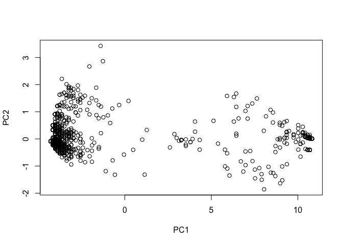
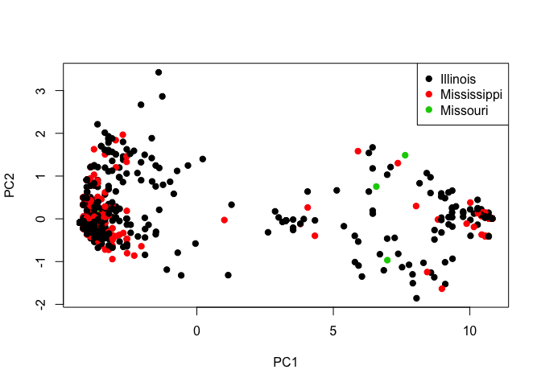

EVE 109 Section Week 6
================

### 1. Match

First of all, great news - no packages to install today!! The first command we'll learn is `match`. `match` helps you match up two vectors that have the same values (or subset of values). For example, so far I've always given you metadata in the same order as your genotype files. But what if I didnt? We can use `match` to reorder the metadata so that it matches the genotype dataframe. Here's how it works. First, let's make two vectors with roughly the same values in different orders.

``` r
A <- c("FOX","BEAR","DOG","CAT","MOUSE")
B <- c("BEAR","CAT","MOUSE","FOX","DOG")
match(A,B)
```

    ## [1] 4 1 5 2 3

`match` looks at each value in the first vector and returns the *index* of that value in the second vector. Note that the order matters:

``` r
match(B,A)
```

    ## [1] 2 4 5 1 3

We can then use match to reorder the vectors to match:

``` r
C <- B[match(A,B)]
C
```

    ## [1] "FOX"   "BEAR"  "DOG"   "CAT"   "MOUSE"

So here we've taken the `B` vector and reordered it to match A.

     

### 2. Dealing with missing data

Sometimes data aren't perfect. Sometimes we have missing values. How do we deal with them, or at least find them? Let's look at he `airquality` example dataset:

``` r
data("airquality")
head(airquality)
```

    ##   Ozone Solar.R Wind Temp Month Day
    ## 1    41     190  7.4   67     5   1
    ## 2    36     118  8.0   72     5   2
    ## 3    12     149 12.6   74     5   3
    ## 4    18     313 11.5   62     5   4
    ## 5    NA      NA 14.3   56     5   5
    ## 6    28      NA 14.9   66     5   6

Notice that there are several **NA** values. The first thing we might want to do is to identify all rows that have **NA** values. We can identify rows with missing data in a particular column using the `is.na` function:

``` r
is.na(airquality$Ozone)
```

    ##   [1] FALSE FALSE FALSE FALSE  TRUE FALSE FALSE FALSE FALSE  TRUE FALSE
    ##  [12] FALSE FALSE FALSE FALSE FALSE FALSE FALSE FALSE FALSE FALSE FALSE
    ##  [23] FALSE FALSE  TRUE  TRUE  TRUE FALSE FALSE FALSE FALSE  TRUE  TRUE
    ##  [34]  TRUE  TRUE  TRUE  TRUE FALSE  TRUE FALSE FALSE  TRUE  TRUE FALSE
    ##  [45]  TRUE  TRUE FALSE FALSE FALSE FALSE FALSE  TRUE  TRUE  TRUE  TRUE
    ##  [56]  TRUE  TRUE  TRUE  TRUE  TRUE  TRUE FALSE FALSE FALSE  TRUE FALSE
    ##  [67] FALSE FALSE FALSE FALSE FALSE  TRUE FALSE FALSE  TRUE FALSE FALSE
    ##  [78] FALSE FALSE FALSE FALSE FALSE  TRUE  TRUE FALSE FALSE FALSE FALSE
    ##  [89] FALSE FALSE FALSE FALSE FALSE FALSE FALSE FALSE FALSE FALSE FALSE
    ## [100] FALSE FALSE  TRUE  TRUE FALSE FALSE FALSE  TRUE FALSE FALSE FALSE
    ## [111] FALSE FALSE FALSE FALSE  TRUE FALSE FALSE FALSE  TRUE FALSE FALSE
    ## [122] FALSE FALSE FALSE FALSE FALSE FALSE FALSE FALSE FALSE FALSE FALSE
    ## [133] FALSE FALSE FALSE FALSE FALSE FALSE FALSE FALSE FALSE FALSE FALSE
    ## [144] FALSE FALSE FALSE FALSE FALSE FALSE  TRUE FALSE FALSE FALSE

We can then ask for the indexes of those "TRUE" values and subset the data with those indexes:

``` r
ind <- is.na(airquality$Ozone)
sub <- airquality[ind,]
head(sub)
```

    ##    Ozone Solar.R Wind Temp Month Day
    ## 5     NA      NA 14.3   56     5   5
    ## 10    NA     194  8.6   69     5  10
    ## 25    NA      66 16.6   57     5  25
    ## 26    NA     266 14.9   58     5  26
    ## 27    NA      NA  8.0   57     5  27
    ## 32    NA     286  8.6   78     6   1

More likely, though, we'll want to want a subset *without* missing data. We can get this using `!` which, in programming languages often makes a function the opposite meaning. So, `!is.na` helps us find entries that do not have missing data:

``` r
ind <- !is.na(airquality$Ozone)
sub <- airquality[ind,]
head(sub)
```

    ##   Ozone Solar.R Wind Temp Month Day
    ## 1    41     190  7.4   67     5   1
    ## 2    36     118  8.0   72     5   2
    ## 3    12     149 12.6   74     5   3
    ## 4    18     313 11.5   62     5   4
    ## 6    28      NA 14.9   66     5   6
    ## 7    23     299  8.6   65     5   7

What if we want to look at missing data across the entire dataframe? First, we can use the function `complete.cases` to ask which rows have no missing data. We can also use the `which` function to ask for the indexes of those rows. These indexes could be used to subset the dataframe into only complete rows:

``` r
complete.cases(airquality)
```

    ##   [1]  TRUE  TRUE  TRUE  TRUE FALSE FALSE  TRUE  TRUE  TRUE FALSE FALSE
    ##  [12]  TRUE  TRUE  TRUE  TRUE  TRUE  TRUE  TRUE  TRUE  TRUE  TRUE  TRUE
    ##  [23]  TRUE  TRUE FALSE FALSE FALSE  TRUE  TRUE  TRUE  TRUE FALSE FALSE
    ##  [34] FALSE FALSE FALSE FALSE  TRUE FALSE  TRUE  TRUE FALSE FALSE  TRUE
    ##  [45] FALSE FALSE  TRUE  TRUE  TRUE  TRUE  TRUE FALSE FALSE FALSE FALSE
    ##  [56] FALSE FALSE FALSE FALSE FALSE FALSE  TRUE  TRUE  TRUE FALSE  TRUE
    ##  [67]  TRUE  TRUE  TRUE  TRUE  TRUE FALSE  TRUE  TRUE FALSE  TRUE  TRUE
    ##  [78]  TRUE  TRUE  TRUE  TRUE  TRUE FALSE FALSE  TRUE  TRUE  TRUE  TRUE
    ##  [89]  TRUE  TRUE  TRUE  TRUE  TRUE  TRUE  TRUE FALSE FALSE FALSE  TRUE
    ## [100]  TRUE  TRUE FALSE FALSE  TRUE  TRUE  TRUE FALSE  TRUE  TRUE  TRUE
    ## [111]  TRUE  TRUE  TRUE  TRUE FALSE  TRUE  TRUE  TRUE FALSE  TRUE  TRUE
    ## [122]  TRUE  TRUE  TRUE  TRUE  TRUE  TRUE  TRUE  TRUE  TRUE  TRUE  TRUE
    ## [133]  TRUE  TRUE  TRUE  TRUE  TRUE  TRUE  TRUE  TRUE  TRUE  TRUE  TRUE
    ## [144]  TRUE  TRUE  TRUE  TRUE  TRUE  TRUE FALSE  TRUE  TRUE  TRUE

``` r
which(complete.cases(airquality))
```

    ##   [1]   1   2   3   4   7   8   9  12  13  14  15  16  17  18  19  20  21
    ##  [18]  22  23  24  28  29  30  31  38  40  41  44  47  48  49  50  51  62
    ##  [35]  63  64  66  67  68  69  70  71  73  74  76  77  78  79  80  81  82
    ##  [52]  85  86  87  88  89  90  91  92  93  94  95  99 100 101 104 105 106
    ##  [69] 108 109 110 111 112 113 114 116 117 118 120 121 122 123 124 125 126
    ##  [86] 127 128 129 130 131 132 133 134 135 136 137 138 139 140 141 142 143
    ## [103] 144 145 146 147 148 149 151 152 153

``` r
sub <- airquality[which(complete.cases(airquality)),]
head(sub)
```

    ##   Ozone Solar.R Wind Temp Month Day
    ## 1    41     190  7.4   67     5   1
    ## 2    36     118  8.0   72     5   2
    ## 3    12     149 12.6   74     5   3
    ## 4    18     313 11.5   62     5   4
    ## 7    23     299  8.6   65     5   7
    ## 8    19      99 13.8   59     5   8

This is useful if you need the indexes to work across multiple dataframes (more on that later). But, if you just want to remove rows with missing data, you can just us `na.omit`:

``` r
sub <- na.omit(airquality)
head(airquality)
```

    ##   Ozone Solar.R Wind Temp Month Day
    ## 1    41     190  7.4   67     5   1
    ## 2    36     118  8.0   72     5   2
    ## 3    12     149 12.6   74     5   3
    ## 4    18     313 11.5   62     5   4
    ## 5    NA      NA 14.3   56     5   5
    ## 6    28      NA 14.9   66     5   6

Finally, some functions will not automatically work if you have missing data. For example, look what happens when you try to fine the mean Ozone value across the dataset:

``` r
mean(airquality$Ozone)
```

    ## [1] NA

We need to tell the function what to do with NA values. The easiest thing to do is just ignore them:

``` r
mean(airquality$Ozone,na.rm=T)
```

    ## [1] 42.12931

     

### 3. Writing your own functions

So far, we've used a bunch of different functions that are provided by either the basic installation of R or various packages. But you can also write your own!

Let's say we are interested in a very specific metric calculated as follows: (mean of all values)/(number of non-missing datapoints)  We want to calculate this for each row. We know that we can do row by row calculations using the `apply` function, but how do we put this weird function into `apply`? First, we need to define our own function. This is how we do that:

``` r
ourfunction <- function(x) {
  top <- mean(x,na.rm=T)
  bottom <- length(!is.na(x))
  metric <- top/bottom
  return(top)
}
```

Here we can think of `x` as each row that will be passed through the function. At the end of the function we use `return` to tell the function what value we want to get out. We could apply this to any set of numbers:

``` r
a <- c(1,4,54,72,4,1)
ourfunction(a)
```

    ## [1] 22.66667

Or we can apply our new function to each row in the dataframe:

``` r
ourmetric <- apply(airquality,MARGIN=1,ourfunction)
ourmetric
```

    ##   [1] 51.90000 40.16667 42.60000 68.91667 20.07500 23.98000 67.93333
    ##   [8] 33.96667 20.35000 57.32000 20.78000 61.28333 65.70000 64.31667
    ##  [15] 29.03333 74.08333 73.50000 30.40000 75.91667 25.28333 17.28333
    ##  [22] 74.60000 21.28333 37.66667 33.92000 73.98000 24.25000 24.66667
    ##  [29] 71.15000 76.28333 72.56667 75.92000 75.74000 66.82000 57.84000
    ##  [36] 64.92000 73.86000 43.45000 76.18000 80.13333 79.41667 75.98000
    ##  [43] 73.84000 46.66667 89.16000 86.70000 54.31667 72.78333 25.86667
    ##  [50] 40.25000 43.71667 52.06000 32.94000 40.12000 72.46000 49.80000
    ##  [57] 49.00000 32.66000 44.70000 31.58000 53.00000 83.35000 66.70000
    ##  [64] 61.36667 41.38000 56.43333 76.81667 76.68333 79.55000 80.45000
    ##  [71] 62.23333 49.52000 63.38333 52.98333 83.58000 28.55000 69.81667
    ##  [78] 70.88333 76.88333 64.01667 67.75000 21.98333 75.54000 83.70000
    ##  [85] 83.26667 76.00000 37.43333 44.33333 70.90000 75.73333 74.06667
    ##  [92] 73.53333 36.48333 22.96667 32.23333 36.58000 28.08000 34.32000
    ##  [99] 80.83333 72.38333 72.00000 68.12000 50.70000 58.91667 69.25000
    ## [106] 55.61667 35.50000 34.05000 36.71667 41.23333 65.15000 58.38333
    ## [113] 66.91667 26.88333 74.72000 62.95000 87.23333 69.33333 56.34000
    ## [120] 70.28333 79.38333 76.88333 68.71667 61.81667 63.85000 60.63333
    ## [127] 65.10000 41.73333 39.75000 63.15000 58.05000 59.15000 64.11667
    ## [134] 65.98333 65.41667 61.88333 22.98333 38.58333 65.48333 58.13333
    ## [141] 25.55000 61.38333 56.00000 59.60000 24.70000 49.71667 28.05000
    ## [148] 24.60000 55.81667 54.24000 55.21667 45.16667 60.25000

     

### 4. Hybrid allele frequencies

Today we'll be looking at the data from Lamer et al. (2015). Let's first read in the genotype table:

``` r
genofile <- read.csv("data/genotypes.csv")
head(genofile)
```

    ##       ID snp1 snp2 snp3 snp4 snp5 snp6 snp7 snp8 snp9 snp10 snp11 snp12
    ## 1 ILAG 1    0    0    0    0    0    0    0    0    0     0     0     0
    ## 2 ILAG 2    0    0    1    0    0    0    0    0    0     0     0     0
    ## 3 ILAG 3    0    0    0    0    0    0    0    0    0     0     0     0
    ## 4 ILAG 4    0    0    1    0    0    0    0    0    0     0     0     0
    ## 5 ILAG 5    0    0    0    0    0    0    0    0    0     0     0     0
    ## 6 ILAG 6    0    0    0    0    0    0    0    0    0     0     0     0
    ##   snp13 snp14 snp15 snp16 snp17 snp18 snp19 snp20 snp21 snp22 snp23 snp24
    ## 1     0    NA     0     0     0     0     0     0     0     0     0     0
    ## 2     0     0     0     0     0     0     0     0     0     0     0     0
    ## 3     0     0     0     0     0     0     0     0     0     0     0     0
    ## 4     0     0     0     0     0     0     0     0     0     0     0     0
    ## 5     0    NA     0     0     0     0     0     0     0     0    NA    NA
    ## 6     0     0     0     0     0     0     0     0     0     0    NA    NA
    ##   snp25 snp26 snp27 snp28 snp29 snp30 snp31 snp32 snp33 snp34 snp35 snp36
    ## 1     0     0     0     0     0     0     0     0     0     0     0     0
    ## 2     0    NA     0     0     0     0     0     0     0     0     0     0
    ## 3     0     0     0     0     0     0     0     1     0     0     0     0
    ## 4     0     0     0     0     0     0     0     0     0     0     0     0
    ## 5    NA    NA    NA    NA    NA    NA    NA    NA    NA    NA    NA    NA
    ## 6    NA    NA    NA    NA    NA    NA    NA    NA    NA    NA    NA    NA
    ##   snp37 snp38 snp39 snp40 snp41 snp42 snp43 snp44 snp45 snp46 snp47 snp48
    ## 1     0     0     0     0     0     0     0     0     0     0     0     0
    ## 2    NA     0     0     0     0     0     0     0     0     0     0     0
    ## 3     0     0     0     0     1     0     0     0     0     0     0     0
    ## 4     0     0     0     0     0     0     0     0     0     0     0     0
    ## 5    NA    NA    NA    NA    NA    NA    NA    NA     0     0     0     1
    ## 6    NA    NA    NA    NA    NA    NA    NA    NA     0     0     0     0
    ##   snp49 snp50 snp51 snp52 snp53 snp54 snp55 snp56 snp57
    ## 1     0     0     0     0     0     0     0     0     0
    ## 2     0     0     0     0     0     0     0     0     0
    ## 3     0     0     0     0     0     0     0     0     0
    ## 4     0     0     0     0     0     0     0     0     0
    ## 5     0     0     0     0     0     0     0     0     0
    ## 6     0     0     0     0     0     0     0     0     0

Here the first column is a sample ID. The rest of the columns are genotypes at diagnostic SNPs that distinguish between the two carp species in the paper. Values are 0, 1, or 2 and indicate the number of silver carp alleles at that SNP. So, for example, a 2 means that individual is homozygous for the silver carp allele while a 0 means that individual is homozygous for the bighead carp allele. Let's split the dataframe into the sample IDs and a frame with just the genotypes:

``` r
IDs <- genofile[,1]
genos <- genofile[,2:ncol(genofile)]
```

Now let's read in the metadata:

``` r
meta <- read.csv("data/metadata.csv")
head(meta)
```

    ##         ID          Reach    River Genetic.ID Field.ID Length Weight Age
    ## 1 ILAG 566 LaGrange Reach Illinois      Bx4SV     <NA>     NA     NA  NA
    ## 2 ILAG 567 LaGrange Reach Illinois      Bx4SV     <NA>     NA     NA  NA
    ## 3 ILAG 568 LaGrange Reach Illinois      Bx4SV     <NA>     NA     NA  NA
    ## 4 ILAG 569 LaGrange Reach Illinois         SV     <NA>     NA     NA  NA
    ## 5 ILAG 570 LaGrange Reach Illinois         SV     <NA>     NA     NA  NA
    ## 6 ILAG 571 LaGrange Reach Illinois         SV     <NA>     NA     NA  NA
    ##   Birth.year
    ## 1         NA
    ## 2         NA
    ## 3         NA
    ## 4         NA
    ## 5         NA
    ## 6         NA

Notice that the metadata and the genotypes are *not* in the same order. We'll use match like we did above to reorder the metadata:

``` r
ordermeta <- meta[match(IDs,meta$ID),]
```

Now that the genotype and metadata are aligned, we can do lots of different calculations. Maybe we want to calculate the fraction of silver carp alleles for each individual. We can write a function for that:

``` r
allelefreq <- function(x) {
  length <- length(na.omit(x))
  sum <- sum(x, na.rm=T)
  freq <- sum/(length*2)
  return(freq)
}
```

The first line of the function calculates the length of the vector (the number of loci at which an individual is genotyped) - notice that we have omitted missing data. The second line simply adds the genotypes. We can do this because we know that hetorozygous individuals are coded as 1 and homozygous silver carp individuals are coded as 2. The third row calculates the frequency of silver carp alleles. Why do we have to multiple length by 2? Now we can apply that function to our genotype data:

``` r
silvAlleles <- apply(genos[,2:ncol(genos)],1,allelefreq)
summary(silvAlleles)
```

    ##    Min. 1st Qu.  Median    Mean 3rd Qu.    Max. 
    ## 0.00000 0.00000 0.01786 0.31645 0.99010 1.00000

Now we can do things like look at the mean frequency across different species classes (how accurate were our field IDs) or rivers (which river has the most introduced alleles?):

``` r
aggregate(silvAlleles,list(ordermeta$Field.ID),mean)
```

    ##   Group.1          x
    ## 1    BHCP 0.98368557
    ## 2  Hybrid 0.76715273
    ## 3    SVCP 0.02414646
    ## 4    UNKN 0.28395949

``` r
a <- aggregate(silvAlleles,list(ordermeta$River),mean)
```

     

### 4. Hybrid allele frequencies

Now we want to make a PCA to visualize the similarity between individuals. We can do this with the `prcomp` function, but this function doesn't like missing data. There are some ways to deal with missing genotypes without having to discard them, but since we have a lot of data we will just remove individuals that have any missing data for now. We also have to subset the metadata to match:

``` r
subgen <- na.omit(genos)
head(subgen)
```

    ##    snp1 snp2 snp3 snp4 snp5 snp6 snp7 snp8 snp9 snp10 snp11 snp12 snp13
    ## 3     0    0    0    0    0    0    0    0    0     0     0     0     0
    ## 4     0    0    1    0    0    0    0    0    0     0     0     0     0
    ## 19    0    0    0    0    0    0    0    0    0     0     0     0     0
    ## 25    0    0    0    0    0    0    0    0    0     0     0     0     0
    ## 26    0    0    0    0    0    0    0    0    0     0     0     0     0
    ## 27    0    0    0    0    0    0    0    0    0     0     0     0     0
    ##    snp14 snp15 snp16 snp17 snp18 snp19 snp20 snp21 snp22 snp23 snp24 snp25
    ## 3      0     0     0     0     0     0     0     0     0     0     0     0
    ## 4      0     0     0     0     0     0     0     0     0     0     0     0
    ## 19     0     0     0     0     0     0     0     0     0     0     0     0
    ## 25     0     0     0     0     0     0     0     0     0     0     0     0
    ## 26     0     0     0     0     0     0     0     0     0     0     0     0
    ## 27     0     0     0     0     0     0     0     0     0     0     0     0
    ##    snp26 snp27 snp28 snp29 snp30 snp31 snp32 snp33 snp34 snp35 snp36 snp37
    ## 3      0     0     0     0     0     0     1     0     0     0     0     0
    ## 4      0     0     0     0     0     0     0     0     0     0     0     0
    ## 19     0     0     0     0     0     0     0     0     0     0     0     0
    ## 25     0     0     0     0     0     0     0     0     0     0     0     0
    ## 26     0     0     0     0     0     0     0     0     0     0     0     0
    ## 27     0     0     0     0     0     0     0     0     0     0     0     0
    ##    snp38 snp39 snp40 snp41 snp42 snp43 snp44 snp45 snp46 snp47 snp48 snp49
    ## 3      0     0     0     1     0     0     0     0     0     0     0     0
    ## 4      0     0     0     0     0     0     0     0     0     0     0     0
    ## 19     0     0     0     0     0     0     0     0     0     0     0     0
    ## 25     0     0     0     0     0     0     0     0     0     0     0     0
    ## 26     0     0     0     0     0     0     0     0     0     0     0     0
    ## 27     0     0     0     0     0     0     0     0     0     0     0     0
    ##    snp50 snp51 snp52 snp53 snp54 snp55 snp56 snp57
    ## 3      0     0     0     0     0     0     0     0
    ## 4      0     0     0     0     0     0     0     0
    ## 19     0     0     0     0     0     0     0     0
    ## 25     0     0     0     0     0     0     0     0
    ## 26     0     0     0     0     0     0     0     0
    ## 27     0     0     0     0     0     0     0     0

``` r
submeta <- ordermeta[complete.cases(genos),]
head(submeta)
```

    ##           ID          Reach    River Genetic.ID Field.ID Length Weight Age
    ## 1079  ILAG 3 LaGrange Reach Illinois      Bx4SV     SVCP    362    525   3
    ## 1080  ILAG 4 LaGrange Reach Illinois      Bx4SV     SVCP    371    600   1
    ## 1095 ILAG 19 LaGrange Reach Illinois         SV     SVCP    619   2550   4
    ## 1101 ILAG 25 LaGrange Reach Illinois         SV     SVCP    453   1050   2
    ## 1102 ILAG 26 LaGrange Reach Illinois         SV     SVCP    336    500   1
    ## 1103 ILAG 27 LaGrange Reach Illinois         SV     SVCP    364    600   1
    ##      Birth.year
    ## 1079       2006
    ## 1080       2008
    ## 1095       2005
    ## 1101       2007
    ## 1102       2008
    ## 1103       2008

This works because we *know* that `genos` and `ordermeta` are in the same order. Now we can use this subsetted data to calculate a PCA and plot it:

``` r
pca <- prcomp(subgen)
plot(pca$x)
```



This doesn't really mean anything if we don't categorize the dots. For now, let's color them by "River":

``` r
plot(pca$x,col=submeta$River,pch=19)
legend("topright", legend=levels(submeta$River), pch=19, col=1:nlevels(submeta$River))
```



As you can see, there doesn't seem to be obvious separation by River. What do you think is driving the patterns you see in this PCA?

     

Homework
========

 

For homework we will continue using the data from Lamer et al. (2015).  

### *Homework 5: Write a script that does the following:*

#### 1. Read in the "genotypes.csv" and "metadata.csv". Reorder the metadata so that samples in the same order as in the genotypes file.

#### 2. Write a function that returns the proportion of data for each individual that is missing. Apply the function to your genotype data and print the summary.

#### 3. Create a PCA. Color by Field.ID and add a legend.
